  

  

  
  
  

## About Me

I am Nishant, a ServiceNow-focused builder interested in ITSM, platform automation, service operations, and practical data-backed improvement. I like turning support process pain points into tools that make work clearer for agents, managers, and business users.

- ServiceNow Developer / ServiceNow BA mindset with an ITSD and ITSM focus
- Comfortable shaping ideas from business process to tables, rules, flows, dashboards, and documentation
- Interested in incident lifecycle automation, follow-up governance, catalog experiences, analytics, and agent productivity
- Public profile content here is intentionally generic: no client names, instance IDs, internal screenshots, employee data, or proprietary implementation details

## ServiceNow & ITSM Toolkit

  
  
  
  
  
  
  
  
  
  
  
  
  

## Certifications

- ServiceNow certifications and micro-certifications: add verified credentials here as they are earned
- ITSM / process / business analysis learning: keep this section reserved for confirmed credentials only

## Featured Projects

**Incident Follow-up Assistant**  
A ServiceNow scoped app concept for incidents moved to **On Hold + Awaiting Caller**. It auto-creates follow-up records, classifies them as **Upcoming**, **Due**, and **Overdue**, supports inline updates from an Agent Command Center, writes structured Incident work notes, sends due/overdue reminders, provides a Team Manager dashboard, and tracks ageing, attempts, response outcomes, and repeat pending cycles with light/dark dashboard themes.

**ResolveFlow**  
A resolution workflow idea for making ITSM handoffs clearer, more measurable, and easier to follow from intake to closure.

**AgentTouch**  
A ServiceNow agent productivity concept focused on faster updates, cleaner task context, and lower-friction daily work.

**RSA Repeat Caller / Catalog POC**  
A proof-of-concept for identifying repeat caller patterns and improving catalog-driven service intake.

**User360 Hub**  
A single-view support concept for understanding requester context, open work, recent history, and service signals.

**AccessGuard**  
An access request and governance concept for safer approvals, cleaner audit context, and role-aware fulfillment.

**Incident Productivity / Analytics**  
Dashboard and analytics ideas for incident throughput, ageing, pending reasons, follow-up health, and operational focus areas.

## Current Focus

- Building ServiceNow portfolio projects that show both developer execution and BA/process thinking
- Improving scoped app patterns, Flow Designer usage, clean table design, and operational dashboards
- Practicing better documentation: architecture notes, process maps, demo scripts, and user-friendly README files
- Exploring analytics for service desk productivity, follow-up discipline, and incident lifecycle health

## GitHub Activity

  
  

  
  

  

## Contribution Flow

  <picture>
    <source media="(prefers-color-scheme: dark)" srcset="https://raw.githubusercontent.com/Corefindr/Corefindr/output/github-contribution-grid-snake-dark.svg" />
    <source media="(prefers-color-scheme: light)" srcset="https://raw.githubusercontent.com/Corefindr/Corefindr/output/github-contribution-grid-snake.svg" />
    
  </picture>

## Connect

  
  

---

  

